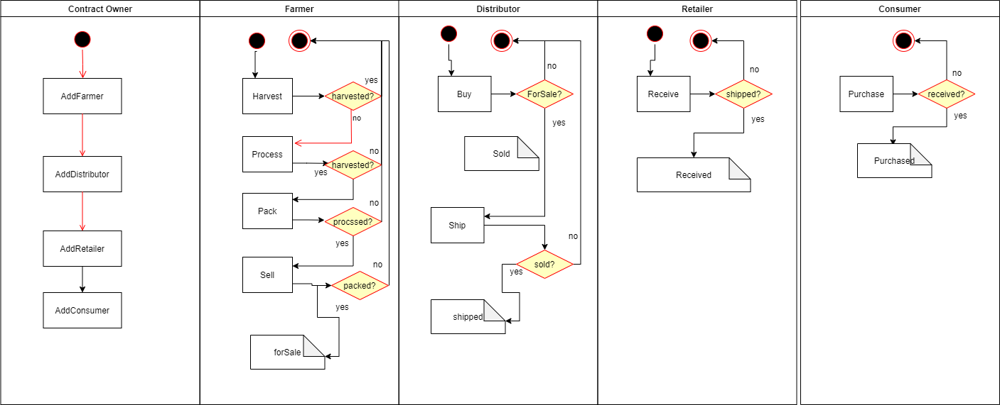

# Crypto Supply Chain

## Roles and Access controls
- Farmer: The Farmer can harvest coffee beans, process coffee beans, pack coffee palettes, add coffee palettes, ship coffee palettes, and track authenticity.
- Distributor: The Distributor can buy coffee palettes and track authenticity.
- Retailer: The Retailer can receive coffee palettes and track authenticity.
- Consumer: The consumer can buy coffee palettes and track authenticity.

# Libraries

- truffle-assertions - to help assert the events being emitted
- truffle-contract - to help use the contract in the front-end
- web3 - to interact with the Ethereum network using javascript in the front-end

# IPFS

Not used

# Acknowledgments

- Truffle v5.3.9 (core: 5.3.9)
- Solidity - 0.8.0 (solc-js)
- Node v14.17.0
- Web3.js v1.3.6
- Ganache 5

# To run tests

run the following command:

- truffle test

# To test frontend locally

run the following command on:

- npm run dev

go to http://localhost:3000/

If you have the owner account on Metamask you can go ahead and test all buttons:

### Farmer Actions
Harvest > Process > Pack > ForSale

You can use *Fetch Data 1* and *Fetch Data 2* to verify the information in the blockchain

### Distributor actions
Buy > Ship

You can use *Fetch Data 1* and *Fetch Data 2* to verify the information in the blockchain

### Retailer actions
Receive

You can use *Fetch Data 1* and *Fetch Data 2* to verify the information in the blockchain

### Consumer actions
Purchase

You can use *Fetch Data 1* and *Fetch Data 2* to verify the information in the blockchain

# Commands
- npm run dev
- truffle migrate --reset
- truffle migrate --network rinkebyal

# Contract Address on Rinkeby

- https://rinkeby.etherscan.io/address/0x7Ce83dCdDd26fcDBF7e8bA0a343Ca7C86a344B3c
- transaction hash:    0x8fbc8c0ae1ee6f7098d3ac726eb877a20aacb3cbd56b536cbb979a58a46991f4