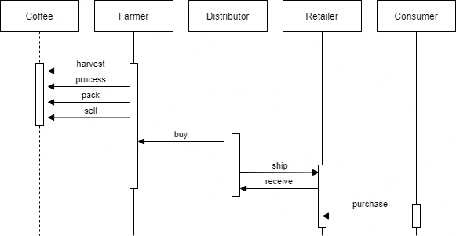
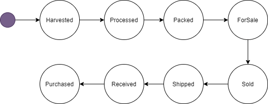
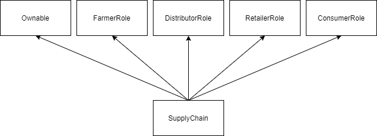

# Crypto Supply Chain

## Roles and Access controls
- Farmer: The Farmer can harvest coffee beans, process coffee beans, pack coffee palettes, add coffee palettes, ship coffee palettes, and track authenticity.
- Distributor: The Distributor can buy coffee palettes and track authenticity.
- Retailer: The Retailer can receive coffee palettes and track authenticity.
- Consumer: The consumer can buy coffee palettes and track authenticity.

# Libraries

- truffle-assertions
- truffle-contract
- web3

# IPFS

Not used

# Acknowledgments

- Truffle v5.3.9 (core: 5.3.9)
- Solidity - 0.8.0 (solc-js)
- Node v14.17.0
- Web3.js v1.3.6
- Ganache 5
